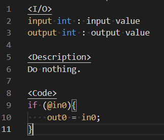

# midiglue-node Language for VS Code

This is language support for .node file of midiglue and midiglue Editor.

The midiglue is programmable MIDI & CV Processor for musicians and programmer.

midiglue : http://sigboost.audio/midiglue

Refer to the midiglue manual for how to describe the .node file.

midiglue_manual : http://sigboost.audio/midiglue/manual

## Features

- syntax highlighting

## Preview

## Note

This extension only supports the latest midiglue Editor.
